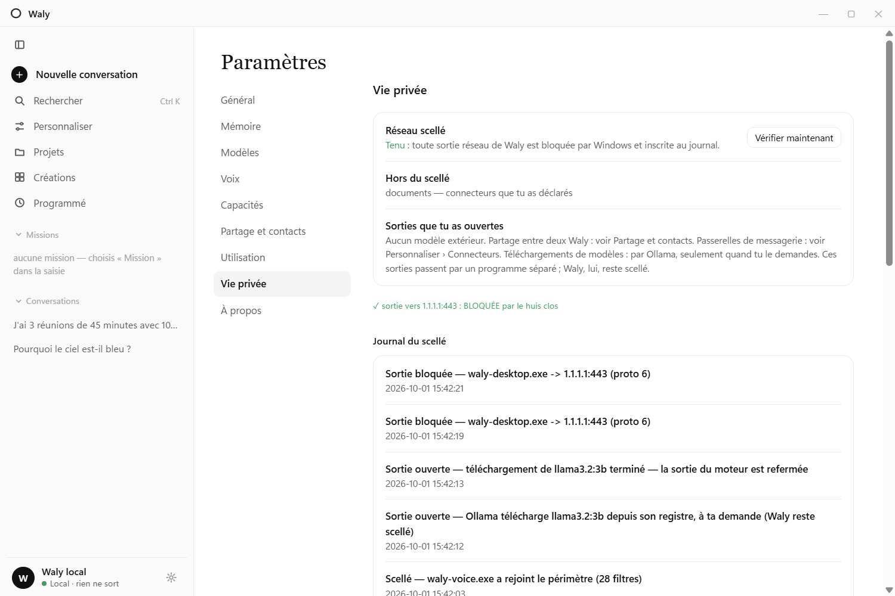

# Waly — the intelligence that stays

**A 100 % local, privacy-provable personal AI assistant for Windows.**
Real-time French voice conversation, camera and screen vision, persistent
memory, wake word — and a kernel-level network seal that makes "nothing
leaves your machine" a *verifiable fact*, not a promise.

*Il voit tout. Rien ne sort.* — [Version française](README.fr.md)



*"Nothing leaves" you can check: the built-in test makes a real outbound
connection from Waly's own process — the kernel blocks it and the journal
records it, next to the exits you opened yourself.*

| Deep reflection, shown before the answer | Models judged for *your* machine |
|---|---|
|  |  |

| A voice call, on your machine | A video call: Waly sees you, the camera stays local |
|---|---|
|  |  |


*A conversation sent by a contact, end-to-end encrypted, waiting for your
approval. Calls between two Waly users come next (see below).*

> ⚠️ **Status: pre-alpha, reference-hardware only.** Waly is developed and
> measured on one reference machine (AMD Ryzen AI 5 340 — XDNA 2 NPU, Radeon
> 840M iGPU, 15 GB usable RAM, Windows 11). It runs there end-to-end today.
> Portability (other NPUs, GPU-only setups, more RAM headroom) is the next
> frontier — issues and measurements from other machines are very welcome.

## Why another local assistant?

The 2026 local-AI landscape is full of great *building blocks* (Ollama,
LM Studio, Whisper, Piper…) and modular smart-home stacks. Waly is different
in three ways:

1. **Provable privacy (« huis clos »).** A Windows Filtering Platform seal —
   installed as a SYSTEM service — blocks all outbound network traffic from
   Waly's processes at the kernel level, keeps loopback (model server) alive,
   and writes every blocked attempt to an auditable local journal. You can
   *test* the seal from inside the app. No other assistant we know of does
   this.
2. **An integrated assistant, not a chatbot.** Streaming voice cascade
   (VAD → STT → LLM → TTS) with barge-in, camera "call mode" with visual
   memory, screen sharing with OCR-first understanding, wake word, persistent
   SQLite memory with local embeddings, supervised tool-calling with
   human-in-the-loop approvals — one installable desktop app.
3. **French-first.** Voice, prosody, prompts and product are designed for
   French (English planned), where most of the ecosystem is English-only.

## Architecture

- `apps/desktop/` — Tauri 2 desktop app (vanilla-JS webview, Rust core
  in-process), NSIS installer
- `crates/waly-core/` — orchestrator: chat, native tools, memory
  (SQLite + sqlite-vec + local e5-small embeddings), safety walls,
  HITL approvals, file hands (real files, plus Word/Excel/PowerPoint/PDF
  documents generated natively from markdown)
- `crates/waly-voice/` — voice cascade: Silero VAD, Parakeet STT, semantic
  endpointing, Pocket TTS (streaming, French) with Piper fallback, wake word
  (openWakeWord-compatible ONNX)
- `crates/waly-sight/` — perception: camera (YuNet presence/attention),
  screen capture + local ONNX OCR, VLM moments
- `crates/waly-relais/` — the tiny self-hostable relay that lets two Waly
  installs exchange an end-to-end encrypted conversation (it only stores
  sealed envelopes — see its [README](crates/waly-relais/README.md))
- `crates/waly-seal/` — the network seal: per-session WFP filters, Windows
  service, audit journal, fail-closed by design. **Usable as a standalone
  brick to seal any local agent** — see its
  [README](crates/waly-seal/README.md)
- `engines/` — install/launch scripts for the inference engines
  (FastFlowLM on NPU, Ollama Vulkan fallback). Binaries and models live
  outside git.
- `docs/` — ADRs, RFCs, measured phase reports (in French — the build log
  of the whole project)
- `lab/` — benches and research spikes (never shipped)

Inference is OpenAI-compatible HTTP against a local server: FastFlowLM on
the AMD NPU (primary; free binary kernels, MIT CLI) or Ollama on Vulkan
(fallback, fully open source). Default brain: `qwen3vl-it:4b` — one resident
multimodal model for text and vision, within a signed ~6.5 GB RAM budget.

## Privacy guarantees (and honest non-guarantees)

- No pixels and no raw OCR text are ever persisted — only one-line VLM
  descriptions in the local visual journal. Verified against the database.
- The WFP seal blocks outbound traffic from Waly's executables and logs every
  drop (exe, address:port, protocol). The WebView2 UI process is shared with
  the OS and sits outside the seal; it is hardened via CSP and browser flags
  instead. See `docs/ONEPAGER-2026-07-21-huis-clos-conformite.md` for the
  full guarantee/non-guarantee list.
- **Nothing leaves without your say.** Everything that can go out is an
  exit *you* open, one by one, visible while it is open and written to the
  seal journal: an outside model with your own key, a messaging bridge, a
  conversation sent to a contact, a model download. Waly's own processes
  stay sealed — these exits go through a separate gateway process (the
  system `curl`) to the single address you declared. Known gap: that
  gateway is not yet itself sealed per destination
  (`docs/ADR-2026-10-01-lot3-sorties-ouvertes.md`).
- **An outside model only ever receives the text of the conversation on
  screen** — never your memory, instructions, screen, images or tools; an
  attached file only if you allow it for that one message. This is enforced
  by the harness, not left to the model. Missions, screen sharing and images
  always stay local.

## Getting started

Requirements today: Windows 11, an AMD Ryzen AI (XDNA 2) machine for the NPU
path *or* any machine that can run Ollama with a 4B model, ~7 GB free RAM.

```bash
# 1. Engines (PowerShell, from the repo root)
engines/check-setup.ps1          # verify environment
engines/start-flm.ps1 -PMode turbo   # NPU path; port 42626 by default
# No FLM? Waly falls back automatically to a standard Ollama on 11434.
# Any OpenAI-compatible server works (port: WALY_LLM_PORT,
# model name: WALY_MODEL, default qwen3vl-it:4b).

# 2. Build (see CONTRIBUTING.md for the two build loops)
cargo build --release --target x86_64-pc-windows-gnu

# 3. Or install the packaged app: bin/Waly-Setup.exe (built via
#    apps/desktop/installer/build-installer.sh)
```

**First launch: the right model for your machine.** Waly detects your RAM,
graphics card, NPU and Smart App Control, compares them with the models
already installed in Ollama, and recommends a brain (plus a vision model if
the brain can't see) with the exact `ollama pull` commands. Click the model
name in the status bar, or run `waly materiel`. Waly never downloads
anything itself — it is sealed.

Configuration lives in one optional file, `C:\waly\data\waly.toml` (copy
[`waly.toml.example`](waly.toml.example); `WALY_CONFIG` moves it): local
server port and model, your first name, database path. Environment
variables (`WALY_LLM_PORT`, `WALY_MODEL`, `WALY_USER`, `WALY_DB`,
`WALY_TTS`/`WALY_TTS_SPEAKER`) still take precedence.

**Community tools via MCP.** Declare any stdio MCP server under
`[mcp.<name>]` in `waly.toml` (see the example file). MCP servers are
third-party processes that run *outside* the network seal — so each MCP
tool call asks for your approval unless you mark the server
`confiance = "lecture"`.

**Adaptive vision.** Waly asks the engine what the brain model can do. If
it sees, images go straight to it. If it doesn't (a text-only model), set
`modele_vision` in `waly.toml` (e.g. `gemma3:4b`): that model looks at each
image and describes it to the brain. Without either, Waly says honestly
that it cannot see — and suggests the installed models that can.

**Choosing who answers.** The model menu switches the local brain on the
fly (any installed Ollama model), or picks an outside model — Claude,
Mistral, OpenAI or your own OpenAI-compatible server — with **your own
key**, encrypted by Windows (DPAPI). *Auto* routes each message: local
first, only substantial text work goes out, and every answer says who
replied and where it went. *Deep reflection* makes a local model write its
reasoning in a collapsible block before answering (slower; a small model
can still be wrong). Waly can also ask Ollama to download a model, with a
"fits well / slow / too big" verdict for your machine.

**From your phone, and to a friend.** A Telegram bridge lets one paired
phone (8-digit code, private chat only) talk to the local model while the
app is open. And two Waly installs can send each other a conversation
anywhere in the world, with no account: X25519 identities, NaCl
`crypto_box`, through a relay you host (`crates/waly-relais`). What you
receive waits for your approval.

**Coming next: calls between two Waly users.** The goal is simple: two
people talking — voice first, then video — about a conversation they share,
each with their own local assistant at hand, and nobody in the middle. Same
principle as sharing: no account, end-to-end encryption, a relay that
carries sealed traffic it cannot read. This is **not built yet**; today only
conversations travel.

> These outward-facing features are new (October 2026). Their full path is
> covered by offline end-to-end tests (`apps/desktop/e2e/`) against local
> servers; they have **not yet been exercised against the real providers**.

Missions teach Waly: after a successful multi-step mission it distills a
reusable **learned skill** (steps, tools, pitfalls — never personal data)
and applies it to similar missions later. See them under *Compétences*.

## Roadmap

See [ROADMAP.md](ROADMAP.md) — near-term: distilled French TTS, `waly.toml`
+ any OpenAI-compatible backend, local MCP client, English mode.

## Contributing

See [CONTRIBUTING.md](CONTRIBUTING.md). The codebase and its documentation
are largely in French; contributions in French or English are equally
welcome. Start with `docs/RFC-2026-07-03-knowledge-navigator-reconstruction.md`
(architecture) and `ROADMAP.md` (current priorities).

## License

[MIT](LICENSE). Third-party models, voices and engines keep their own
licenses — see [THIRD_PARTY_NOTICES.md](THIRD_PARTY_NOTICES.md) (note: the
wake word's feature models are currently non-commercial).
