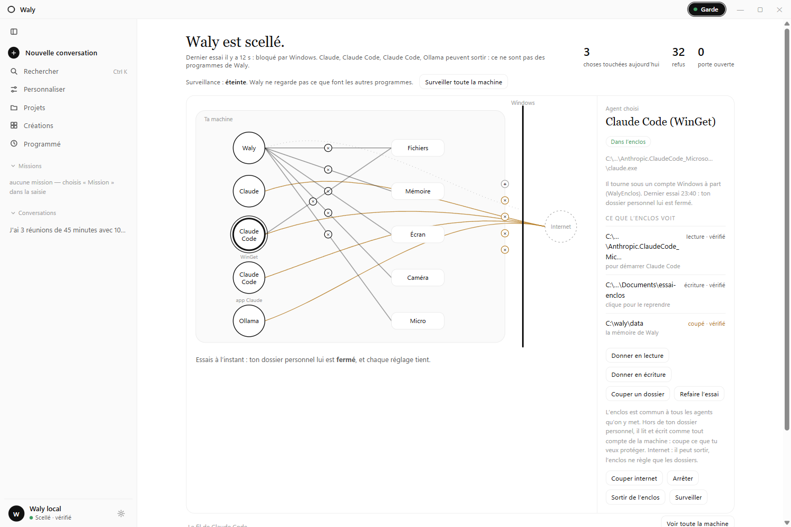
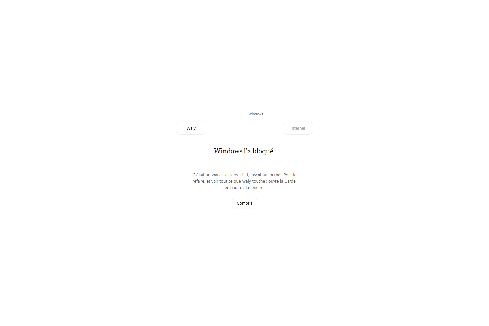
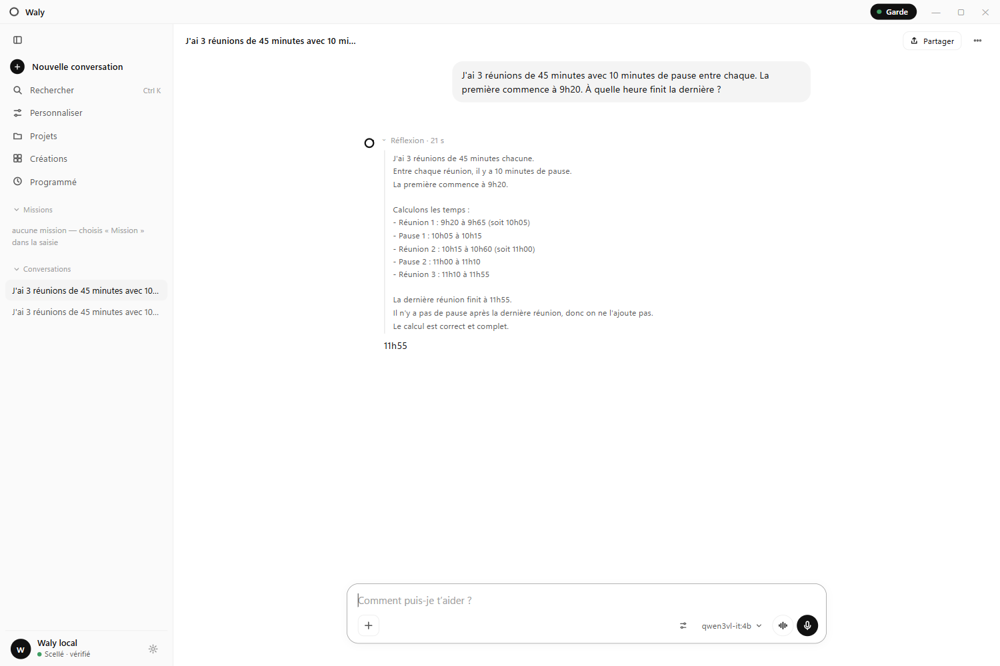
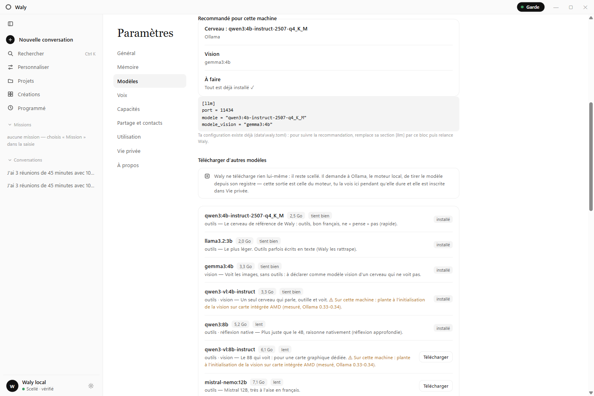
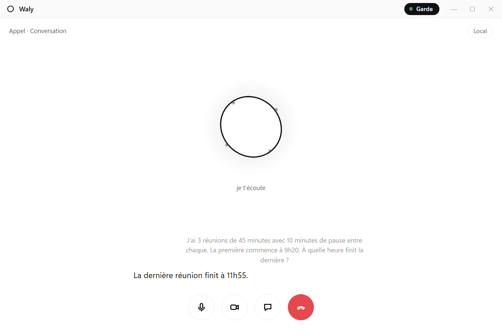
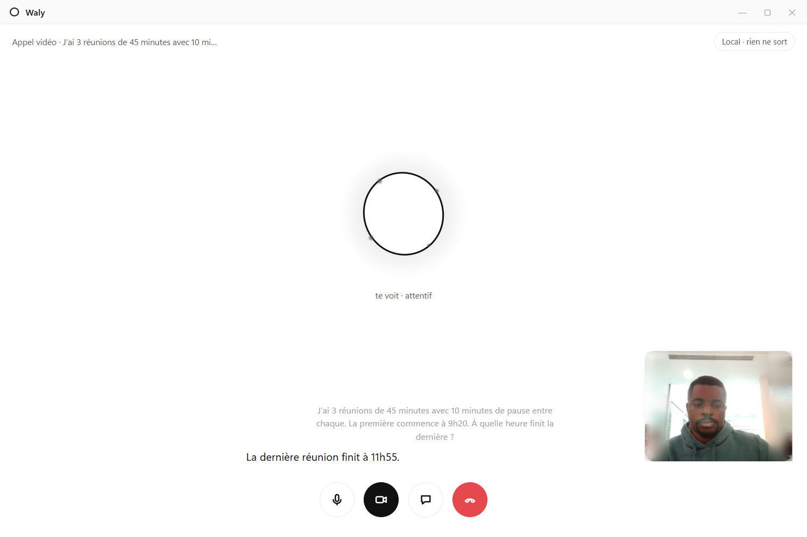
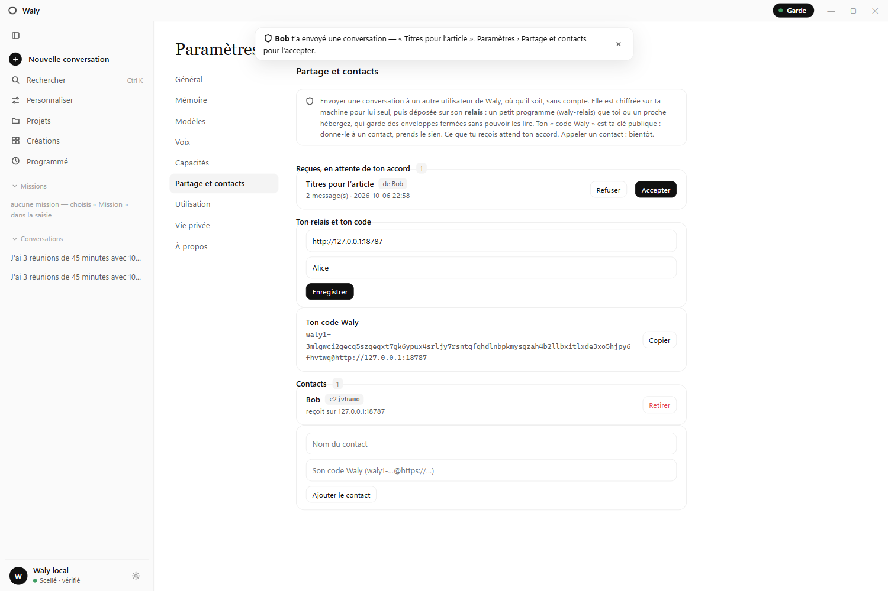

# Waly — a personal intelligence system, under your watch

[](https://github.com/Michee-007/waly/actions/workflows/ci.yml)
[](LICENSE)
[](https://github.com/Michee-007/waly/issues?q=is%3Aissue+is%3Aopen+label%3A%22good+first+issue%22)

**A personal intelligence system for Windows: an assistant that hears you,
sees you, remembers and acts, and the guard post for every AI agent on your
machine.** You see what each one touches (files, memory, screen,
camera, microphone, internet) and you cut it off. Waly is local and sealed
by default: real-time voice (French today, built to be adapted to English),
camera and screen vision, persistent memory, wake word, and a kernel-level
network seal that it proves with a real attempt before it displays it.

*See what AI touches. Cut it off whenever you want.* — [Version française](README.fr.md)



*The Guard ("la Garde"), a real capture (empty database, the real agents of
the reference machine: the Claude app, two Claude Code and one Ollama; when
two agents share a name, the Guard says where each one comes from). Each of
Waly's links is cut with one click. The selected Claude Code runs in the enclosure: a
separate Windows account that Windows keeps out of your folders until you
hand one over. Every setting is followed by a real attempt, and it is the
result of that attempt that is displayed.*



*First launch: Waly makes a real attempt to reach the internet in front of
you, and shows what Windows did with it.*

| Deep reflection, shown before the answer | Models judged for *your* machine |
|---|---|
|  |  |

| A voice call, on your machine | A video call: Waly sees you, the camera stays local |
|---|---|
|  |  |



*A conversation sent by a contact, end-to-end encrypted, waiting for your
approval. Calls between two Waly users come next (see below).*

> ⚠️ **Status: pre-alpha, reference-hardware only.** Waly is developed and
> measured on one reference machine (AMD Ryzen AI 5 340 — XDNA 2 NPU, Radeon
> 840M iGPU, 15 GB usable RAM, Windows 11). It runs there end-to-end today.
> Portability (other NPUs, GPU-only setups, more RAM headroom) is the next
> frontier — issues and measurements from other machines are very welcome.

## Why another local assistant?

The 2026 local-AI landscape is full of great *building blocks* (Ollama,
LM Studio, Whisper, Piper…) and modular smart-home stacks. Waly is different
in four ways.

**Why a *system*, not one more assistant.** An assistant answers. A personal
intelligence system holds together what perceives, remembers and acts around
one person: voice, sight, memory, tools, and the other agents running on the
same machine. Its author's definition: *you must be able to see what the AI
touches.* Without that it is not a system, it is a box.

The idea behind all of it: such a system connects a
whole digital life and acts for one person, so what you can entrust to it
depends less on how smart it is than on what you can **check without
spending your life checking**
([the thesis, and where others do it better](docs/RESEARCH-2026-10-06-these-et-etat-de-l-art.md)).

1. **The Guard: see what AI touches, and cut it off.** One always-visible
   button opens one page: what Waly touched today (the file, the action,
   never the content), a graph whose every link can be cut or restored with
   a click, and the event feed. The other agents on the machine (Ollama,
   Claude, Codex, OpenClaw, Hermes…) are on it too: you can cut their
   internet access, freeze them, watch what they open, and move them into
   **the enclosure**, a separate Windows account that Windows keeps out of
   your folders. What holds and what does not is written below and in the
   decision records
   ([watching](docs/ADR-2026-10-06-garde-voir-ce-que-les-agents-touchent.md),
   [the enclosure](docs/ADR-2026-10-06-garde-l-enclos.md)).
2. **Provable privacy (« huis clos »).** A Windows Filtering Platform seal —
   installed as a SYSTEM service — blocks all outbound network traffic from
   Waly's processes at the kernel level, keeps loopback (model server) alive,
   and writes every blocked attempt to an auditable local journal. You can
   *test* the seal from inside the app, and Waly runs that test on its own
   before it displays "sealed". Confining an agent's network is not
   new — Anthropic, OpenAI and NVIDIA shipped sandboxes for coding and
   personal agents in 2026, some of them better designed than ours on
   specific points. What we have not found elsewhere is the combination: a
   voice-and-vision assistant for one person, sealed by default, with the
   proof in the user's hands. See the
   [honest comparison](docs/RESEARCH-2026-10-06-these-et-etat-de-l-art.md).
3. **An integrated assistant, not a chatbot.** Streaming voice cascade
   (VAD → STT → LLM → TTS) with barge-in, camera "call mode" with visual
   memory, screen sharing with OCR-first understanding, wake word, persistent
   SQLite memory with local embeddings, supervised tool-calling with
   human-in-the-loop approvals — one installable desktop app.
4. **Not an English-only assistant.** Waly was built in French first —
   interface, voice and prompts — in an ecosystem that is mostly
   English-only. It is not meant to stay French-only: the language model is
   multilingual, and what is French today (interface strings, the voice,
   the prompts, a few speech guards) is exactly what an **English mode**
   has to adapt. That mode is not built yet; it is a top roadmap item and a
   good place to contribute.

## Architecture

- `apps/desktop/` — Tauri 2 desktop app (vanilla-JS webview, Rust core
  in-process), NSIS installer
- `crates/waly-core/` — orchestrator: chat, native tools, memory
  (SQLite + sqlite-vec + local e5-small embeddings), safety walls,
  HITL approvals, file hands (real files, plus Word/Excel/PowerPoint/PDF
  documents generated natively from markdown)
- `crates/waly-voice/` — voice cascade: Silero VAD, Parakeet STT, semantic
  endpointing, Pocket TTS (streaming, French) with Piper fallback, wake word
  (openWakeWord-compatible ONNX)
- `crates/waly-sight/` — perception: camera (YuNet presence/attention),
  screen capture + local ONNX OCR, VLM moments
- `crates/waly-relais/` — the tiny self-hostable relay that lets two Waly
  installs exchange an end-to-end encrypted conversation (it only stores
  sealed envelopes — see its [README](crates/waly-relais/README.md))
- `crates/waly-seal/` — the Guard's service: the network seal (per-session
  WFP filters, audit journal, fail-closed by design), the watch over what
  programs touch, and the creation of the enclosure account. **The seal is
  usable as a standalone brick for any local agent** — see its
  [README](crates/waly-seal/README.md)
- `engines/` — install/launch scripts for the inference engines
  (FastFlowLM on NPU, Ollama Vulkan fallback). Binaries and models live
  outside git.
- `docs/` — ADRs, RFCs, measured phase reports (in French — the build log
  of the whole project)
- `lab/` — benches and research spikes (never shipped)

Inference is OpenAI-compatible HTTP against a local server: FastFlowLM on
the AMD NPU (primary; free binary kernels, MIT CLI) or Ollama on Vulkan
(fallback, fully open source). Default brain: `qwen3vl-it:4b` — one resident
multimodal model for text and vision, within a signed ~6.5 GB RAM budget.

## Privacy guarantees (and honest non-guarantees)

**See it without digging.** The "Garde" button at the top is always visible,
and turns ochre when an exit is open or the seal does not hold. Its page
shows the last real attempt, lets you run another one, and lists the exits
you opened. On first launch Waly runs that attempt in front of you, once.

**Other agents on this machine.** Waly lists the known agents that are
running (Ollama, OpenClaw, Hermes, Claude, Codex…). For each one you can:

- **cut its internet access** (Windows asks for consent), then see what it
  tried. The seal works per program, so an agent running on a shared engine
  (Python, Node) takes every program on that engine down with it — Waly says
  so, with the count, before sealing;
- **freeze it**: its processes are suspended until you resume them. No
  elevation; if Waly closes, they resume;
- **watch what it touches**: files opened or written, programs launched,
  addresses contacted — paths, never content. Off by default, turning it on
  needs Windows consent, and the feed is filtered: it shows what looks like
  your files, not an exhaustive trace;
- **move it into the enclosure**: it is closed and relaunched under a
  separate Windows account. Windows itself then refuses your personal folder
  until you hand a folder over (read-only, or read-write), and every setting
  is checked by a real attempt made under that account. Limits: outside your
  personal folder (another drive, `C:\projects`) an enclosed agent reads and
  writes until you cut the folder; the enclosure is shared by the agents you
  put in it; it does not touch the network; an agent you relaunch by hand
  leaves it, and the Guard says so.

We replayed our own promises before publishing: **six defects found and
fixed, six problems still open** — each open problem with the design we
intend to follow and where help is welcome. Read
[`docs/AUDIT-2026-10-02-promesses-rejouees.md`](docs/AUDIT-2026-10-02-promesses-rejouees.md)
before you trust anything below.

- No pixels and no raw OCR text are ever persisted — only one-line VLM
  descriptions in the local visual journal. Verified against the database.
- The WFP seal blocks outbound traffic from Waly's executables and logs every
  drop (exe, address:port, protocol). The WebView2 UI process is shared with
  the OS and sits outside the seal; it is hardened via CSP and browser flags
  instead. See `docs/ONEPAGER-2026-07-21-huis-clos-conformite.md` for the
  full guarantee/non-guarantee list.
- **Nothing leaves without your say.** Everything that can go out is an
  exit *you* open, one by one, visible while it is open and written to the
  seal journal: an outside model with your own key, a messaging bridge, a
  conversation sent to a contact, a model download. Waly's own processes
  stay sealed — these exits go through a separate gateway process (the
  system `curl`) to the single address you declared. Known gap: that
  gateway is not yet itself sealed per destination
  (`docs/ADR-2026-10-01-lot3-sorties-ouvertes.md`).
- **The seal is per program, not per process tree, and an Ollama engine is
  outside it.** A different program launched by a Waly process is not
  covered (the model has no tool to launch one; the gap concerns hostile
  code running inside Waly). Ollama is a shared third-party program that
  downloads its own models, so it keeps its network access unless you seal
  it yourself with the brick.
- **An outside model only ever receives the text of the conversation on
  screen** — never your memory, instructions, screen, images or tools; an
  attached file only if you allow it for that one message. This is enforced
  by the harness, not left to the model. Missions, screen sharing and images
  always stay local.

## Getting started

Requirements today: Windows 11, an AMD Ryzen AI (XDNA 2) machine for the NPU
path *or* any machine that can run Ollama with a 4B model, ~7 GB free RAM.

```bash
# 1. Engines (PowerShell, from the repo root)
engines/check-setup.ps1          # verify environment
engines/start-flm.ps1 -PMode turbo   # NPU path; port 42626 by default
# No FLM? Waly falls back automatically to a standard Ollama on 11434.
# Any OpenAI-compatible server works (port: WALY_LLM_PORT,
# model name: WALY_MODEL, default qwen3vl-it:4b).

# 2. Build (see CONTRIBUTING.md for the two build loops)
cargo build --release --target x86_64-pc-windows-gnu

# 3. Or install the packaged app: bin/Waly-Setup.exe (built via
#    apps/desktop/installer/build-installer.sh)
```

**First launch: the right model for your machine.** Waly detects your RAM,
graphics card, NPU and Smart App Control, compares them with the models
already installed in Ollama, and recommends a brain (plus a vision model if
the brain can't see) with the exact `ollama pull` commands. Click the model
name in the status bar, or run `waly materiel`. Waly never downloads
anything itself — it is sealed.

Configuration lives in one optional file, `C:\waly\data\waly.toml` (copy
[`waly.toml.example`](waly.toml.example); `WALY_CONFIG` moves it): local
server port and model, your first name, database path. Environment
variables (`WALY_LLM_PORT`, `WALY_MODEL`, `WALY_USER`, `WALY_DB`,
`WALY_TTS`/`WALY_TTS_SPEAKER`) still take precedence.

**Community tools via MCP.** Declare any stdio MCP server under
`[mcp.<name>]` in `waly.toml` (see the example file). MCP servers are
third-party processes that run *outside* the network seal — so each MCP
tool call asks for your approval unless you mark the server
`confiance = "lecture"`.

**Adaptive vision.** Waly asks the engine what the brain model can do. If
it sees, images go straight to it. If it doesn't (a text-only model), set
`modele_vision` in `waly.toml` (e.g. `gemma3:4b`): that model looks at each
image and describes it to the brain. Without either, Waly says honestly
that it cannot see — and suggests the installed models that can.

**Choosing who answers.** The model menu switches the local brain on the
fly (any installed Ollama model), or picks an outside model — Claude,
Mistral, OpenAI or your own OpenAI-compatible server — with **your own
key**, encrypted by Windows (DPAPI). *Auto* routes each message: local
first, only substantial text work goes out, and every answer says who
replied and where it went. *Deep reflection* makes a local model write its
reasoning in a collapsible block before answering (slower; a small model
can still be wrong). Waly can also ask Ollama to download a model, with a
"fits well / slow / too big" verdict for your machine.

**From your phone, and to a friend.** A Telegram bridge lets one paired
phone (8-digit code, private chat only) talk to the local model while the
app is open. And two Waly installs can send each other a conversation
anywhere in the world, with no account: X25519 identities, NaCl
`crypto_box`, through a relay you host (`crates/waly-relais`). What you
receive waits for your approval.

**Coming next: calls between two Waly users.** The goal is simple: two
people talking — voice first, then video — about a conversation they share,
each with their own local assistant at hand, and nobody in the middle. Same
principle as sharing: no account, end-to-end encryption, a relay that
carries sealed traffic it cannot read. This is **not built yet**; today only
conversations travel.

> These outward-facing features are new (October 2026). Their full path is
> covered by offline end-to-end tests (`apps/desktop/e2e/`) against local
> servers; they have **not yet been exercised against the real providers**.

Missions teach Waly: after a successful multi-step mission it distills a
reusable **learned skill** (steps, tools, pitfalls — never personal data)
and applies it to similar missions later. See them under *Compétences*.

## Roadmap

See [ROADMAP.md](ROADMAP.md) — near-term: distilled French TTS, `waly.toml`
+ any OpenAI-compatible backend, local MCP client, English mode.

## Contributing

**You do not need the reference hardware to help.** Most of the logic is
plain Rust with unit tests (`cargo test -p waly-core -p waly-relais -p
waly-seal` runs anywhere). Three good ways in:

- pick a [good first issue](https://github.com/Michee-007/waly/issues?q=is%3Aissue+is%3Aopen+label%3A%22good+first+issue%22)
  — the network seal brick and the sharing relay are small and
  self-contained;
- run Waly on your machine and file your numbers with the *Measurement on
  my machine* issue form — the most useful contribution right now;
- help build the **English mode**.

See [CONTRIBUTING.md](CONTRIBUTING.md). The codebase and its documentation
are largely in French; contributions in French or English are equally
welcome. Start with `docs/RFC-2026-07-03-knowledge-navigator-reconstruction.md`
(architecture) and `ROADMAP.md` (current priorities).

## License

[MIT](LICENSE). Third-party models, voices and engines keep their own
licenses — see [THIRD_PARTY_NOTICES.md](THIRD_PARTY_NOTICES.md) (note: the
wake word's feature models are currently non-commercial).
